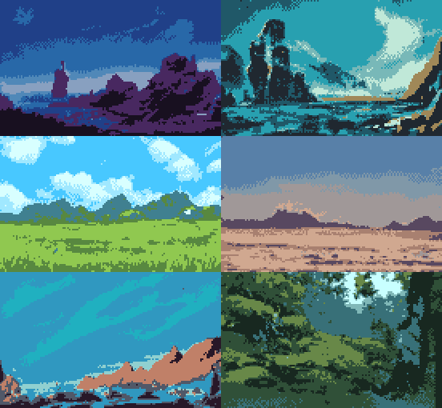

<p align="center">
  
</p>

Super Pyxelate converts images to 8-bit pixel art. It is an improved, faster implementation of the [original Pyxelate](https://github.com/sedthh/pyxelate/releases/tag/1.2.1) algorithm with palette transfer support and enhanced dithering. 


**NOTE:** Check out the new [Retro Diffusion](https://astropulse.gumroad.com/l/RetroDiffusion), a generative AI alternative based on [Stable Diffusion](https://stability.ai/blog/stable-diffusion-public-release)!

# Usage

Once installed, Pyxelate can be used either from the command line or from Python.

```bash
$ pyxelate examples/blazkowicz.jpg output.png --factor 14 --palette 7

Pyxelating examples/blazkowicz.jpg...
Wrote output.png
```

Use `pyxelate --help` for a full list of command-line options, which map onto the
Python arguments described below.

Invoking from Python:

```python
from skimage import io
from pyxelate import Pyx, Pal

# load image with 'skimage.io.imread()'
image = io.imread("examples/blazkowicz.jpg")  

downsample_by = 14  # new image will be 1/14th of the original in size
palette = 7  # find 7 colors

# 1) Instantiate Pyx transformer
pyx = Pyx(factor=downsample_by, palette=palette)

# 2) fit an image, allow Pyxelate to learn the color palette
pyx.fit(image)

# 3) transform image to pixel art using the learned color palette
new_image = pyx.transform(image)

# save new image with 'skimage.io.imsave()'
io.imsave("pixel.png", new_image)
```


Pyxelate extends scikit-learn transformers, allowing the same learned palette to be reused on other, aesthetically **similar** images (so it's somewhat like an 8-bit style transfer): 

```python
car = io.imread("examples/f1.jpg")
robocop = io.imread("examples/robocop.jpg")

# fit a model on each
pyx_car = Pyx(factor=5, palette=8, dither="none").fit(car)
pyx_robocop = Pyx(factor=6, palette=7, dither="naive").fit(robocop)

"""
pyx_car.transform(car)
pyx_car.transform(robocop)
pyx_robocop.transform(car)
pyx_robocop.transform(robocop)
"""
```


For a single image, it is possible to call both fit() and transform() at the same time:

```python
# fit() and transform() on image with alpha channel
trex = io.imread("examples/trex.png")
trex_p = Pyx(factor=9, palette=4, dither="naive", alpha=.6).fit_transform(trex)
```


## Hyperparameters for Pyx()
| Parameter | Description |
| --- | --- |
| height | The height of the transformed image. If only height is set, the width of the transofmed image will be calculated to maintain the aspect ratio of the original. |
| width | The width of the transformed image. If only width is set, the height of the transofmed image will be calculated to maintain the aspect ratio of the original. |
| factor | The size of the transformed image will be `1. / factor` of the original. **Can be used instead of setting width or height.** |
| upscale | Resizes the pixels of the transformed image by upscale. Can be a positive `int` or a tuple of ints for `(h, w)`. Default is `1`. |
| palette | The number of colors in the transformed image. <br /> - If it's an `int` that is larger than 2, Pyxelate will search for this many colors automatically. Default is `8`. <br /> - If it's a `Pal` palette enum object, Pyxelate will use palette transfer to match these colors.|
| dither | The type of dithering to use on the  transformed image (see more exampels below):<br />- `"none"` no dithering is applied (default, takes no additional time)<br />- `"naive"` Pyxelate's naive dithering based on probability mass function (use for images with **alpha channel**) <br />- `"bayer"` Bayer-like ordered dithering using a [4x4 Bayer Matrix](https://www.visgraf.impa.br/Courses/ip00/proj/Dithering1/) (fastest dithering method, use for large images)<br />- `"floyd"` Floyd-Steinberg inspired [error diffusion dithering](https://en.m.wikipedia.org/wiki/Floyd%E2%80%93Steinberg_dithering) (slowest)<br />- `"atkinson"` Atkinson inspired [error diffusion dithering](https://surma.dev/things/ditherpunk/) (slowest) |
| svd | Apply a truncated SVD (`n_components=32`) on each RGB channel as a form of low-pass filter. Default is `True`. |
| alpha | For images with transparency, the transformed image's pixel will be either visible/invisible above/below this threshold. Default is `0.6`. |
| sobel | The size of the sobel operator (N*N area to calculate the gradients for downsampling), must be an `int` larger than 1. Default is `3`, try `2` for a much faster but less accurate output. |
| depth | How many times should the Pyxelate algorithm be applied to downsample the image. More iteratrions will result in blockier aesthatics. Must be a positive `int`, although it is really time consuming and should never be more than 3. Raise it only for really small images. Default is `1`. |

Showcase of available dithering methods:


See more examples in [the example Jupyter Notebook](examples.ipynb).

## Assigning existing palette
Common retro palettes for different hardware (and others like the [PICO-8](https://www.lexaloffle.com/pico-8.php) fantasy console) are available in `Pal`:

```python
from pyxelate import Pyx, Pal

vangogh = io.imread("examples/vangogh.jpg")

vangogh_apple = Pyx(factor=12, palette=Pal.APPLE_II_HI, dither="atkinson").fit_transform(vangogh)
vangogh_mspaint = Pyx(factor=8, palette=Pal.MICROSOFT_WINDOWS_PAINT, dither="none").fit_transform(vangogh)
```


Assign your own palette:
```python
my_pal = Pal.from_hex(["#FFFFFF", "#000000"])

# same but defined with RGB values
my_pal = Pal.from_rgb([[255, 255, 255], [0, 0, 0]])
```

Fitting existing palettes on different images will also have different results for `transform()`.

# Installation
```
pip install git+https://github.com/sedthh/pyxelate.git --upgrade
```

Create a virtual environment:
```
cd pyxelate
pip install virtualenv --upgrade
virtualenv -p python3.9.2 pyxenv

# activate venv on Unix / macOS
source pyxenv/bin/activate
# or on Windows
.\pyxenv\Scripts\activate

pip install -r requirements.txt
```


Pyxelate relies on the following libraries to run (included in *requirements.txt*):
- [sklearn 0.24.1](https://scikit-learn.org/stable/)
- [skimage 0.18.1](https://scikit-image.org/)
- [numba 0.53.1](https://numba.pydata.org/)

# FAQ
The source code is available under the **MIT license** 
but I would appreciate the credit if your work uses Pyxelate (for instance you may add me in the Special Thanks section in the credits of your videogame)!

## How does it work?
Pyxelate downsamples images by (iteratively) dividing it to 3x3 tiles and calculating the orientation of edges inside them. Each tile is downsampled to a single pixel value based on the angle the magnitude of these gradients, resulting in the approximation of a pixel art. This method was inspired by the [Histogram of Oriented Gradients](https://scikit-image.org/docs/dev/auto_examples/features_detection/plot_hog.html) computer vision technique.

Then an unsupervised machine learning method, a [Bayesian Gaussian Mixture](https://scikit-learn.org/stable/modules/generated/sklearn.mixture.BayesianGaussianMixture.html) model is fitted (instead of conventional K-means) to find a reduced palette. The tied gaussians give a better estimate (than  Euclidean distance) and allow smaller centroids to appear and then lose importance to larger ones further away. The probability mass function returned by the uncalibrated model is then used as a basis for different dithering techniques.

Preprocessing and color space conversion tricks are also applied for better results. Singular Value Decomposition can optionally be enabled for noise reduction. 

## PROTIPs
- There is **no one setting fits all**, try experimenting with different parameters for better results! A setting that generates visually pleasing result on one image might not work well for another.
- The bigger the resulting image, the longer the process will take. Note that most parts of the algorithm are **O(H*W)** so an image that is twice the size will take 4 times longer to compute. 
- Assigning existing palettes will take longer for larger palettes, because [LAB color distance](https://scikit-image.org/docs/dev/api/skimage.color.html#skimage.color.deltaE_ciede2000) has to be calculated between each color separately. 
- Dithering takes time (especially *atkinson*) as they are mostly implemented in plain python with loops.

<p align="center">
  <a href="https://twitter.com/OzegoDub" taget="_blank"></a>
</p>

## Creating animations
It is possible to use Pyxelate on a sequence of images to create animations via the CLI tol or the iterator in the `Vid` class. 

| Parameter | Description |
| --- | --- |
| images | List of loaded images (image representations must be numpy arrays) to iterate over |
| pad | In case the original image sequence has black bars, set pad to the height of these bars to cut them off automatically before the conversion process. Can be set as `int` or `(int, int)` for different (top, bottom) values. |
| sobel | The size of the sobel operator used when calling Pyx() (they share the same default value, change it only if you changed it in Pyx()). |
| keyframe | The percentage of difference needed for two frames to be considered similar. If the differenece is bigger, a new keyframe will be created. Default is `0.30`. |
| sensitivity | The percentage of difference between pixels required for two areas to be considered different. Default is `0.10`, lower it if you see unwanted artifacts in your animation, raise it if you want a more layered look. |

You can turn a video into a sequence of images using [ffmpeg](https://www.ffmpeg.org/).
