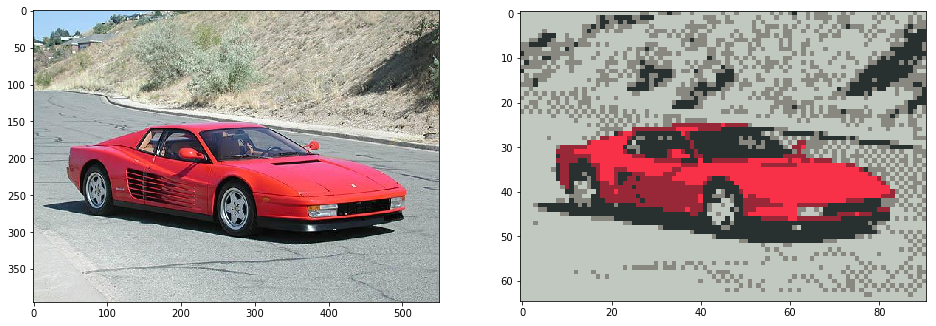
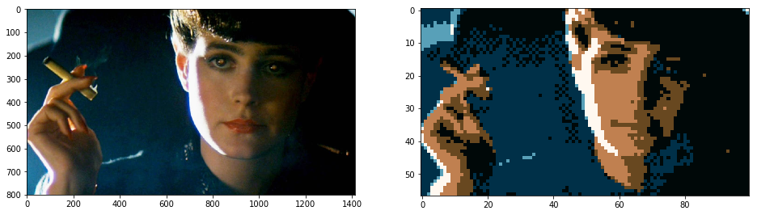
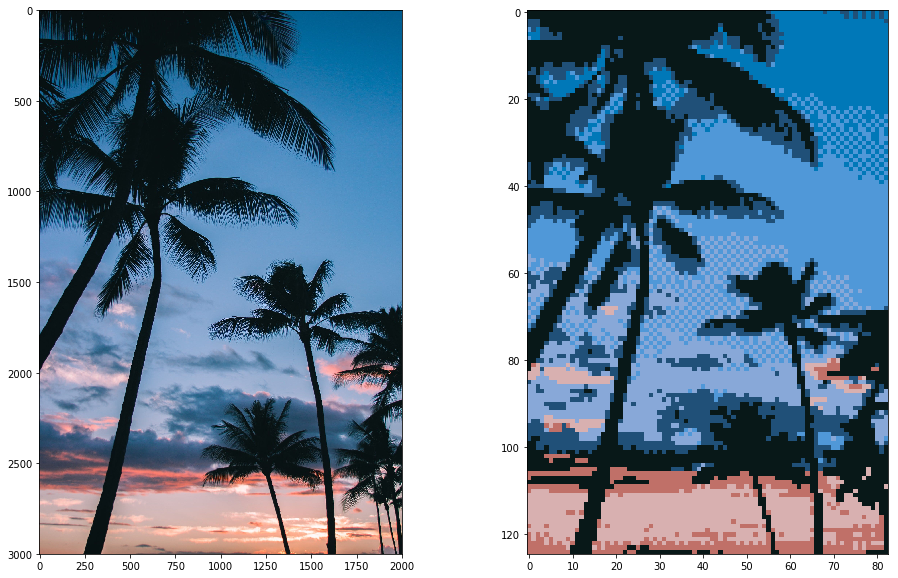
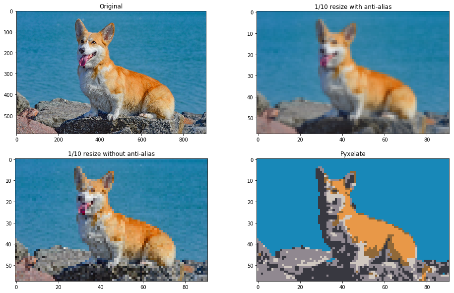
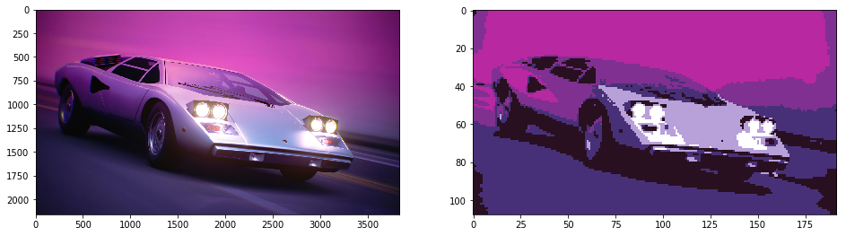

# Pyxelate downsamples images into 8-bit pixel art


The method iteratively approximates a pixel art by sampling values based on the orientation of edges in the input image. 
Then it applies unsupervised machine learning to generate the basis for an 8-bit color palette.  

### Installation

```
pip3 install git+https://github.com/sedthh/pyxelate.git
```



### Example usage:
```python
from pyxelate import Pyxelate
from skimage import io
import matplotlib.pyplot as plt

img = io.imread("blade_runner.jpg")
# generate pixel art that is 1/14 the size
height, width, _ = img.shape 
factor = 14
colors = 6
dither = True

p = Pyxelate(height // factor, width // factor, colors, dither)
img_small = p.convert(img)  # convert an image with these settings

_, axes = plt.subplots(1, 2, figsize=(16, 16))
axes[0].imshow(img)
axes[1].imshow(img_small)
plt.show()
``` 


### API

The **Pyxelate()** class accepts the following init parameters:
- **height**: the height of the result image (height was chosen to be first parameter to mirror the array representation).
- **width**: the width of the result image.
- **color**: the number of colors (default is 8). If the Bayesian Gaussian Mixture model did not converge try a different number of colors.  
- **dither**: apply dithering (default is True). 
- **alpha** (only for images with alpha channel, and sequences): images with alpha channel will be converted in a way, that the pixels will either be transparent or visible above this threshold (default is .60).
- **regenerate_palette**: if set to False, then the palette will only be generated once, and all future images will be generated using this original palette. This is useful for generating a sequence of images with the same palette (the default value is True, all images will have their own palettes).
- **keyframe** (only for sequences): the percentage of absolute difference required between two images for the latter to be considered a new keyframe (default is .6   0).
- **sensitivity** (only for sequences): the percentage of mean absolute difference required between two similar images to re-generate an area (default is .07). 
- **random_state**: the random state for the Bayesian Gaussian Mixture model (default is 0).

Once the class is created, call **convert(image)** by passing a NumPy array representation of the image. The function will return another NumPy array.  

For sequences of images, call **convert_sequence([image1, image2, ...])*** by passing a list of NumPy array representations. The funciton will return a generator for NumPy arrays, after doing the necessary precalculations.   

**NOTE:** the conversion process is pretty time consuming, generating large pixel arts can take quite a while! Converting large lists of images will also take a while to start the conversion.



### Details

The method applies a few computer vision functions for preprocessing. Then simple convolutions are applied on the images. The downsampled areas are calculated based on their gradients' magnitudes and orientation. 
The function was inspired by the [Histogram of Oriented Gradients](https://scikit-image.org/docs/dev/auto_examples/features_detection/plot_hog.html) method.
Once it's done, a [Bayesian Gaussian Mixture](https://scikit-learn.org/stable/modules/generated/sklearn.mixture.BayesianGaussianMixture.html) model is fitted (instead of conventional K-means) to find a reduced palette. 
Using the centroids of the overlapping gaussians as "mean" colors is an empirically better choice,
as cluster centroids for rare colors would have less effect on the rest of the palette due to 
their smaller covariances (allowing flatter gaussians to eventually take over). 
Since it also predicts probabilities, iteratively polling from the first and second best prediction over a threshold allows simple dithering.   
The dirichlet distributions will put less weight on unnecessary clusters as well.  



### CLI

```pyx.py``` is the command line interface for the Pyxelate class and accepts a bunch of arguments to process multiple files one after another.

``` none
usage: pyx.py [-h help] [-i folder of input images or path to single image]
              [-o folder of output images] [-f scale down input image by factor]
              [-s scale up output image by factor] [-c colors] [-d dither]
              [-a alpha] [-r regenerate_palette] [-t random_state] [-w warnings]
```

If no **--output** was defined, a **pyxelated/** folder will be created for output images. 

There is also a [basic GUI](https://github.com/jarreed0/pyxelated-gui) that runs the CLI from a Tkinter window.



### Requirements

The Pyxelate class requires Python 3.7+ and relies on the following libraries to run:
- [skimage 0.16.2](https://scikit-image.org/)
- [sklearn 0.22.1](https://scikit-learn.org/stable/)

### Contribution

There are 2 known bottlenecks in the script caused by iterating over the image matrix. 
If you can figure out a more efficient method (or are able to rewrite it as a GPU shader) it would be great! 

The source code is available under the **MIT license** 
but I would appreciate the credit if your creation uses Pyxelate!
