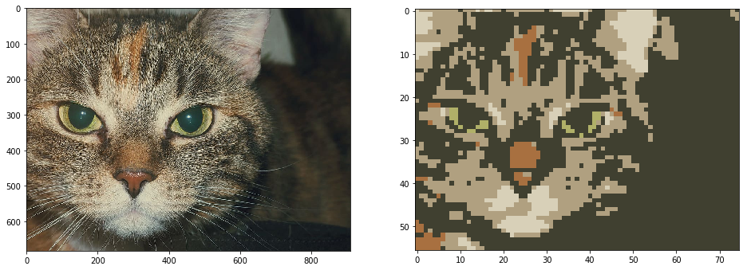

# Generate pixel arts from images
Pyxelate is a Python class that converts images into tiny pixel arts with limited color palettes.


### Installation

```
pip3 install git+https://github.com/sedthh/pyxelate.git
```

### Example usage:
```python
from pyxelate import Pyxelate
from skimage import io
import matplotlib.pyplot as plt

img = io.imread("cat.jpg")
# generate pixel art that is 1/12 the size
height, width, _ = img.shape 
colors = 8
p = Pyxelate(height // 12, width // 12, colors)
img_small = p.convert(img)  # convert img

_, axes = plt.subplots(1, 2, figsize=(16, 16))
axes[0].imshow(img)
axes[1].imshow(img_small)
plt.show()
``` 


### API

The **Pyxelate()** class accepts the following init parameters:
- **height**: the height of the result image (height was chosen to be first parameter to mirror the array representation)
- **width**: the width of the result image
- **color**: the number of colors (default is 8)
- **regenerate_palette**: if set to False, then the palette will only be generated once, and all future images will be generated using this original palette. This is useful for generating a sequence of images with the same palette (the default value is True, all images will have their own palettes).
- **random_state**: the random state for the Bayesian Gaussian Mixture model (default is 0)

Once the class is created, call **convert(image)** by passing a NumPy array representation of the image.  


### Details

The method applies a few computer vision functions and simple convolutions on images and selects pixels based on the calculated gradient's magnitude. 
This was inspired by the [Histogram of Oriented Gradients](https://scikit-image.org/docs/dev/auto_examples/features_detection/plot_hog.html) method.
Then a Gaussian Mixture model is fitted (instead of conventional K-means) to find a reduced palette based on its components.


### CLI

```pyx.py``` is the command line interface for the Pyxelate class and accepts a bunch of arguments to process multiple files one after another.

``` none
usage: pyx.py [-h] [-f factor] [-s scaling] [-c colors] [-r regenerate]
              [-t state] [-p path] [-o path]

Pixelate an image or images in a directory.

optional arguments:
  -h, --help            show this help message and exit
  
  -f factor, --factor factor
                        The factor by which the image should be downscaled. Defaults to 5.
  
  -s scaling, --scaling scaling
                        The factor by which the generated image should be upscaled. Defaults to 5.
  
  -c colors, --colors colors
                        The amount of colors of the pixelated image. Defaults to 8.
  
  -r regenerate, --regenerate regenerate
                        Regenerate the palette for each image. Defaults to True.
  
  -t state, --state state
                        Sets the random state of the Bayesian Gaussian Mixture. Defaults to 0.
  
  -p path, --path path  
                        Path to single image or directory containing images for processing. Defaults to execution directory.

  -o path, --outpath path
                        Path to the directory where the pixelated images are stored. Defaults to <cwd>/pyxelated
```


### Requirements

The Pyxelate class requires Python 3.7+ and relies on the following libraries to run:
- [skimage 0.16.2](https://scikit-image.org/)
- [sklearn 0.22.1](https://scikit-learn.org/stable/)

Limitations: the method does not support dithering, as it would most likely add noise to areas with color gradients, making edges less clear. 

The source code is available under the MIT license.
